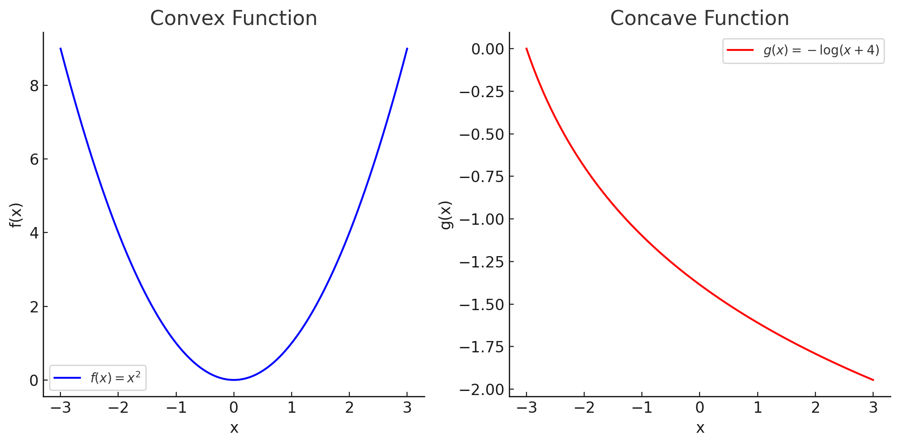

# CAT 2
Module 4
1. How does a neural network work . 
2. Perceptron learning algorithm model.
3. How does a Feed Forward Neural Network work . 
4. Write 10 use cases of FFNN 
5. Convex function VS. Concave function 
6. Types of different gradient descent algorithm 


---

## 1. How Does a Neural Network Work?
A **Neural Network** is a machine learning model inspired by the human brain. It consists of interconnected layers of artificial neurons that process data, learn patterns, and make predictions. 

---

## **Why Do We Use Neural Networks?**
Neural networks are used because:
1. **They can learn complex patterns** in data.
2. **They generalize well** to unseen examples.
3. **They perform tasks like image recognition, natural language processing, and time-series forecasting** better than traditional algorithms.
4. **They can automatically extract features** from raw data.

---

## **Where Do We Use Neural Networks?**
Neural networks are used in various fields, including:

1. **Image Recognition & Computer Vision**  
   - Face recognition (e.g., Facebook, iPhones)  
   - Self-driving cars (detecting objects)  
   - Medical imaging (detecting tumors)

2. **Natural Language Processing (NLP)**  
   - Chatbots (like ChatGPT, Siri, Google Assistant)  
   - Sentiment analysis (detecting positive/negative reviews)  
   - Machine translation (Google Translate)

3. **Speech Recognition & Audio Processing**  
   - Voice assistants (Alexa, Siri)  
   - Speech-to-text conversion  

4. **Finance & Business Analytics**  
   - Stock price prediction  
   - Fraud detection  
   - Customer segmentation  

5. **Healthcare & Medicine**  
   - Disease detection  
   - Drug discovery  
   - Personalized medicine  

6. **Robotics & Automation**  
   - Gesture recognition  
   - Industrial automation  

---

## **How Does a Neural Network Work?**
A **neural network** has three main layers:

1. **Input Layer:** Takes in raw data (e.g., pixels of an image, words in a sentence).  
2. **Hidden Layers:** Process data using weights, biases, and activation functions.  
3. **Output Layer:** Produces the final prediction (e.g., classifies an image as ‘cat’ or ‘dog’).  

Each neuron in a layer is connected to neurons in the next layer through **weights**. The network learns by adjusting these weights using **backpropagation** and **gradient descent**.

---

## **Example: Implementing a Simple Neural Network in Python**
Let's implement a basic neural network using **TensorFlow/Keras** to classify handwritten digits from the **MNIST dataset**.

### **Step 1: Install Dependencies**
```python
pip install tensorflow numpy matplotlib
```

### **Step 2: Import Required Libraries**
```python
import tensorflow as tf
from tensorflow import keras
import numpy as np
import matplotlib.pyplot as plt
```

### **Step 3: Load the MNIST Dataset**
```python
# Load dataset
mnist = keras.datasets.mnist
(X_train, y_train), (X_test, y_test) = mnist.load_data()

# Normalize data (scale pixel values between 0 and 1)
X_train, X_test = X_train / 255.0, X_test / 255.0

# Display an example image
plt.imshow(X_train[0], cmap='gray')
plt.show()
```

### **Step 4: Define a Neural Network Model**
```python
# Create a simple feedforward neural network
model = keras.Sequential([
    keras.layers.Flatten(input_shape=(28, 28)),  # Flatten 28x28 images into a vector
    keras.layers.Dense(128, activation='relu'),  # Hidden layer with 128 neurons
    keras.layers.Dense(10, activation='softmax') # Output layer for 10 classes (digits 0-9)
])

# Compile the model
model.compile(optimizer='adam',
              loss='sparse_categorical_crossentropy',
              metrics=['accuracy'])
```

### **Step 5: Train the Model**
```python
# Train the neural network
model.fit(X_train, y_train, epochs=5)

# Evaluate the model
test_loss, test_acc = model.evaluate(X_test, y_test)
print("Test Accuracy:", test_acc)
```

### **Step 6: Make Predictions**
```python
# Predict the first image in the test set
predictions = model.predict(X_test)
predicted_label = np.argmax(predictions[0])

# Display the result
plt.imshow(X_test[0], cmap='gray')
plt.title(f'Predicted Label: {predicted_label}')
plt.show()
```

---

## **How This Neural Network Works:**
1. **Input Layer:** Takes in a **28x28 pixel** grayscale image.
2. **Flatten Layer:** Converts the image into a **1D array**.
3. **Hidden Layer:** Uses **ReLU activation** to learn patterns.
4. **Output Layer:** Uses **Softmax activation** to classify digits (0-9).
5. **Training:** Adjusts weights using **backpropagation** and **Adam optimizer**.
6. **Evaluation:** Tests model accuracy on unseen data.
7. **Prediction:** Classifies handwritten digits.

---

## **Conclusion**
Neural networks **mimic human learning** and can solve real-world problems in various domains. The **example above** shows how a simple **feedforward neural network** can classify handwritten digits with high accuracy.


---

## 2. Perceptron Learning Algorithm Model

The **Perceptron** is the simplest type of artificial neural network. It is a **binary classifier** that decides whether an input belongs to one class or another using a **linear decision boundary**.

---

## **Why Do We Use the Perceptron Algorithm?**
- It is the **foundation of modern neural networks**.
- It is useful for **linearly separable problems** (e.g., distinguishing between two groups).
- It helps understand how **neural networks learn weights** to make decisions.
- It can be used for **basic pattern recognition, logic gates, and text classification**.

---

## **How Does the Perceptron Work?**
A **perceptron** takes multiple inputs, processes them using **weights**, applies an **activation function**, and produces an output.

### **Step 1: Initialize**
- Assign **random weights** to each input.
- Set a **bias** (optional).

### **Step 2: Compute the Weighted Sum**
Each input  $x_i$  is multiplied by its weight $w_i$ , and their sum is calculated:

$z = (w_1 x_1 + w_2 x_2 + ... + w_n x_n) + b$


### **Step 3: Apply the Activation Function**
The perceptron uses a **step function** (Heaviside function) to classify the input:

$$
y = f(z) =
\begin{cases} 
1, & \text{if } z \geq 0 \\
0, & \text{if } z < 0
\end{cases}
$$
​


### **Step 4: Update Weights (Training)**
- If the perceptron makes a mistake, update the weights using:

$$
w_i = w_i + \eta (y_{\text{true}} - y_{\text{pred}}) x_i
$$

where:
$$
\begin{aligned}
\eta & = \text{Learning rate (small constant like 0.01)} \\
y_{\text{true}} & = \text{Actual output} \\
y_{\text{pred}} & = \text{Predicted output}
\end{aligned}
$$


### **Step 5: Repeat Until Convergence**
The perceptron adjusts weights until it correctly classifies all training examples (if the data is linearly separable).

---

## **Example: Perceptron for AND Logic Gate**
Let's implement a perceptron to learn the **AND** function.

### **Step 1: Import Required Libraries**
```python
import numpy as np
```

### **Step 2: Define the Activation Function**
```python
def step_function(z):
    return 1 if z >= 0 else 0
```

### **Step 3: Implement the Perceptron Algorithm**
```python
class Perceptron:
    def __init__(self, input_size, lr=0.1, epochs=10):
        self.weights = np.random.rand(input_size)  # Initialize random weights
        self.bias = np.random.rand()  # Initialize random bias
        self.lr = lr  # Learning rate
        self.epochs = epochs  # Number of iterations

    def predict(self, X):
        z = np.dot(X, self.weights) + self.bias  # Compute weighted sum
        return step_function(z)  # Apply step activation

    def train(self, X, y):
        for _ in range(self.epochs):
            for i in range(len(X)):
                y_pred = self.predict(X[i])
                error = y[i] - y_pred  # Compute error

                # Update weights and bias
                self.weights += self.lr * error * X[i]
                self.bias += self.lr * error
```

### **Step 4: Train the Perceptron on AND Logic**
```python
# AND gate input and output
X_train = np.array([
    [0, 0],  # 0 AND 0 = 0
    [0, 1],  # 0 AND 1 = 0
    [1, 0],  # 1 AND 0 = 0
    [1, 1]   # 1 AND 1 = 1
])

y_train = np.array([0, 0, 0, 1])  # AND gate output

# Create and train the perceptron
perceptron = Perceptron(input_size=2, lr=0.1, epochs=10)
perceptron.train(X_train, y_train)

# Test the perceptron
for x, y in zip(X_train, y_train):
    print(f"Input: {x} -> Predicted: {perceptron.predict(x)}, Actual: {y}")
```

---

## **Output (Example)**
```
Input: [0 0] -> Predicted: 0, Actual: 0
Input: [0 1] -> Predicted: 0, Actual: 0
Input: [1 0] -> Predicted: 0, Actual: 0
Input: [1 1] -> Predicted: 1, Actual: 1
```

---

## **Key Takeaways**
- The **perceptron** is the simplest form of a neural network.
- It **learns** by adjusting weights based on errors.
- It can only classify **linearly separable data**.
- It is useful for **basic classification problems** like logic gates.


---

## 3. How Does a Feed Forward Neural Network (FFNN) Work?

A **Feed Forward Neural Network (FFNN)** is the simplest type of artificial neural network. It consists of **layers of neurons** where information moves in **one direction only**—from the input layer, through hidden layers (if any), to the output layer.  

---

## **Why Do We Use Feed Forward Neural Networks?**  
FFNNs are used because:  
✅ They can model **complex relationships** between inputs and outputs.  
✅ They are widely used in **image classification, text processing, and financial forecasting**.  
✅ They serve as the **foundation** for deeper neural networks like CNNs and RNNs.  

---

## **Structure of a Feed Forward Neural Network**  
A typical FFNN consists of:  
1️⃣ **Input Layer** – Receives the input features.  
2️⃣ **Hidden Layer(s)** – Processes the input using weighted connections and activation functions.  
3️⃣ **Output Layer** – Produces the final prediction or classification.  

---

## **How Does an FFNN Work?**  
An FFNN follows three key steps:  
### **1. Forward Propagation**  
Each neuron computes a weighted sum of its inputs and applies an **activation function** to introduce non-linearity.  

For a neuron \( j \) in layer \( l \), the output is:  

$$
z_j^{(l)} = \sum_{i} w_{ji}^{(l)} a_i^{(l-1)} + b_j^{(l)}
$$  

$$
a_j^{(l)} = f(z_j^{(l)})
$$  

where:  
$$  
w_{ji}^{(l)} = \text{Weight connecting neuron } i \text{ in the previous layer to neuron } j \text{ in the current layer.}  
$$  

$$  
a_i^{(l-1)} = \text{Activation of neuron } i \text{ from the previous layer.}  
$$  

$$  
b_j^{(l)} = \text{Bias term for neuron } j.  
$$  

$$  
f(z) = \text{Activation function (e.g., ReLU, Sigmoid, Tanh).}  
$$  

### **2. Activation Functions**  
Activation functions introduce non-linearity:  
- **Sigmoid**:  (Used for probabilities) 

$$
f(z) = \frac{1}{1 + e^{-z}}
$$  

- **ReLU (Rectified Linear Unit)**:  (Prevents vanishing gradient)

$$
f(z) = \max(0, z)
$$  

- **Tanh**:  (Centers outputs around 0) 

$$
f(z) = \frac{e^z - e^{-z}}{e^z + e^{-z}}
$$  

### **3. Output Layer**  
- **Regression Tasks**: Uses a **linear activation**.  
- **Binary Classification**: Uses **Sigmoid**.  
- **Multi-class Classification**: Uses **Softmax** to get probabilities.  

$$
\text{Softmax: } a_j = \frac{e^{z_j}}{\sum_{k} e^{z_k}}
$$  

This is used in the output layer for multi-class classification tasks, ensuring that the outputs represent probabilities summing to 1.

---

## **Training an FFNN: Backpropagation & Gradient Descent**  
FFNNs **learn** by updating weights using **backpropagation** and **gradient descent**.  

### **1. Compute Loss**  
The error (loss) between predicted and actual values is computed. Example loss functions:  
- **Mean Squared Error (MSE)** (used for regression tasks):  
  $$  
  L = \frac{1}{N} \sum (y_{\text{true}} - y_{\text{pred}})^2  
  $$  

- **Binary Cross-Entropy** (used for binary classification):  
  $$  
  L = -\frac{1}{N} \sum \left[ y_{\text{true}} \log(y_{\text{pred}}) + (1 - y_{\text{true}}) \log(1 - y_{\text{pred}}) \right]  
  $$  

These loss functions help in training neural networks by measuring how well the model's predictions match the actual values.

### **2. Compute Gradients (Backpropagation)**
Using the chain rule, we calculate how much each weight contributes to the error and adjust accordingly:

This equation represents the gradient of the **loss function** with respect to the weights in a neural network, using the **chain rule** of differentiation:  

$$
\frac{\partial L}{\partial w} = \frac{\partial L}{\partial a} \cdot \frac{\partial a}{\partial z} \cdot \frac{\partial z}{\partial w}
$$  

where

$$  
\frac{\partial L}{\partial a} = \text{Gradient of the loss function with respect to the activation.}  
$$  

$$  
\frac{\partial a}{\partial z} = \text{Derivative of the activation function.}  
$$  

$$  
\frac{\partial z}{\partial w} = \text{Derivative of the weighted sum with respect to the weight.}  
$$  

These derivatives are essential in **backpropagation**, as they help compute the gradients needed for updating the weights using **gradient descent**.

### **3. Update Weights (Gradient Descent)**
Weights are updated using **Gradient Descent**:

The **weight update rule** in gradient descent is given by:  

$$
w = w - \eta \frac{\partial L}{\partial w}
$$  

where:  
- $w$ the weight being updated.  

$$  
\eta \text{ (eta) is the **learning rate**, which controls the step size of updates.}  
$$  

$$  
\frac{\partial L}{\partial w} \text{ is the gradient of the loss function with respect to the weight.}  
$$  

These terms are fundamental in **gradient descent**, where the learning rate determines how quickly the model learns, and the gradient guides the direction of weight updates.

This equation shows how **gradient descent** updates weights by moving in the direction that **minimizes the loss function**, improving the model's performance.

---

## **Example: Implementing an FFNN in Python (Using TensorFlow/Keras)**  
Let's create a simple FFNN for classifying handwritten digits (MNIST dataset).

```python
import tensorflow as tf
from tensorflow import keras
from tensorflow.keras.layers import Dense, Flatten
from tensorflow.keras.models import Sequential
from tensorflow.keras.datasets import mnist

# Load dataset
(x_train, y_train), (x_test, y_test) = mnist.load_data()

# Normalize input data
x_train, x_test = x_train / 255.0, x_test / 255.0

# Define the FFNN model
model = Sequential([
    Flatten(input_shape=(28, 28)),  # Input Layer (Flatten 28x28 pixels)
    Dense(128, activation='relu'),  # Hidden Layer with ReLU
    Dense(10, activation='softmax') # Output Layer (10 classes)
])

# Compile the model
model.compile(optimizer='adam', loss='sparse_categorical_crossentropy', metrics=['accuracy'])

# Train the model
model.fit(x_train, y_train, epochs=5)

# Evaluate the model
test_loss, test_acc = model.evaluate(x_test, y_test)
print("Test Accuracy:", test_acc)
```

---

## **Key Takeaways**
- FFNNs process data **in one direction** (no loops).  
- They consist of an **input layer, hidden layers, and an output layer**.  
- They learn using **forward propagation, backpropagation, and gradient descent**.  
- Activation functions (ReLU, Sigmoid, Softmax) add non-linearity.  
- FFNNs are used in **image classification, NLP, financial forecasting, and medical diagnosis**.  


---

## 4. **10 Use Cases of Feed Forward Neural Networks** 

A **Feedforward Neural Network (FNN)** is the simplest type of artificial neural network where information flows in one direction—from input to output—without any loops or cycles. They are widely used in various domains due to their ability to learn patterns and make predictions.  

---

### **1. Image Classification**  
📌 **Use Case:** Handwritten Digit Recognition (MNIST)  
- FNNs can classify handwritten digits by learning patterns from pixel data.  
- Example: The **MNIST dataset** contains grayscale images of digits (0-9), and an FNN can be trained to recognize them.  


#### **Example: MNIST Digit Classification (Using PyTorch)**  
```python
import torch
import torch.nn as nn
import torch.optim as optim
from torchvision import datasets, transforms

# Load dataset
transform = transforms.ToTensor()
train_loader = torch.utils.data.DataLoader(datasets.MNIST(root='./data', train=True, transform=transform, download=True), batch_size=32, shuffle=True)

# Define FNN
class FNN(nn.Module):
    def __init__(self):
        super(FNN, self).__init__()
        self.fc1 = nn.Linear(28*28, 128)
        self.fc2 = nn.Linear(128, 10)

    def forward(self, x):
        x = x.view(-1, 28*28)
        x = torch.relu(self.fc1(x))
        return torch.softmax(self.fc2(x), dim=1)

model = FNN()
criterion = nn.CrossEntropyLoss()
optimizer = optim.Adam(model.parameters(), lr=0.001)

# Training loop (1 epoch for simplicity)
for images, labels in train_loader:
    optimizer.zero_grad()
    output = model(images)
    loss = criterion(output, labels)
    loss.backward()
    optimizer.step()
```

---

### **2. Sentiment Analysis**  
📌 **Use Case:** Movie or Product Reviews  
- FNNs can analyze text sentiment (positive/negative) by processing word embeddings as input.  
- Example: Predicting whether a brand review is **positive** or **negative** based on customer feedback.  


#### **Example: Sentiment Classification (Using TensorFlow/Keras)**  
```python
import tensorflow as tf
from tensorflow.keras.models import Sequential
from tensorflow.keras.layers import Dense, Embedding, Flatten
import numpy as np

# Sample data: Sentences represented as word indices
X_train = np.array([[1, 2, 3], [4, 5, 6], [7, 8, 9]])  # Word indices
y_train = np.array([0, 1, 0])  # Sentiments (0=negative, 1=positive)

# Define FNN
model = Sequential([
    Embedding(input_dim=10, output_dim=5, input_length=3),
    Flatten(),
    Dense(10, activation='relu'),
    Dense(1, activation='sigmoid')
])

model.compile(optimizer='adam', loss='binary_crossentropy', metrics=['accuracy'])

# Train the model
model.fit(X_train, y_train, epochs=10, verbose=1)
```

---

### **3. Fraud Detection**  
**Use Case:** Credit Card Fraud Detection  
- FNNs can detect fraudulent transactions by analyzing transaction patterns (amount, location, time).  
- Example: A **bank's fraud detection system** can flag unusual spending behavior.  

---

### **4. Medical Diagnosis**  
**Use Case:** Disease Prediction  
- FNNs can classify diseases based on medical records, symptoms, or genetic data.  
- Example: Predicting whether a patient has **diabetes** based on features like blood pressure, insulin level, etc.  

---

### **5. Stock Price Prediction**  
**Use Case:** Financial Forecasting  
- FNNs can process historical stock data to predict future prices.  
- Example: Predicting the **next day’s closing price** of a stock based on past trends.  

---

### **6. Speech Recognition**  
**Use Case:** Voice Assistants (Siri, Google Assistant)  
- FNNs can convert spoken words into text for applications like **speech-to-text transcription**.  
- Example: **Google Voice Typing** uses neural networks to transcribe spoken words into text.  

---

### **7. Spam Detection**  
**Use Case:** Email Spam Classification  
- FNNs can classify emails as **spam or not spam** based on word frequency and metadata.  
- Example: Gmail’s **spam filter** uses neural networks to detect phishing emails.  

---

### **8. Object Detection in Robotics**  
**Use Case:** Industrial Robot Vision  
- FNNs help robots detect and recognize objects in their surroundings.  
- Example: **Self-driving cars** use neural networks to detect obstacles, pedestrians, and traffic signals.  

---

### **9. Customer Churn Prediction**  
**Use Case:** Telecom Industry (Predicting if a user will leave a service)  
- FNNs analyze customer behavior to predict whether they will cancel a subscription.  
- Example: **Netflix** predicts if a user will cancel their subscription based on their viewing patterns.  

---

### **10. Handwriting Recognition**  
**Use Case:** Signature Verification  
- FNNs can recognize handwritten characters and verify signatures for security purposes.  
- Example: **Banks** use neural networks to detect **forged signatures** in checks.  

---

### **Summary Table**  

| Use Case | Industry | Example |
|----------|----------|---------|
| Image Classification | Computer Vision | Handwritten digit recognition |
| Sentiment Analysis | NLP | Product reviews analysis |
| Fraud Detection | Banking | Credit card fraud detection |
| Medical Diagnosis | Healthcare | Disease classification |
| Stock Price Prediction | Finance | Predicting stock trends |
| Speech Recognition | AI Assistants | Google Voice Typing |
| Spam Detection | Email Security | Gmail Spam Filter |
| Object Detection | Robotics | Self-driving cars |
| Customer Churn Prediction | Telecom | Netflix user retention |
| Handwriting Recognition | Security | Signature verification |


---

## 5. **Convex Function vs. Concave Function**

#### **1. Convex Function**  
A function \( f(x) \) is **convex** if its second derivative is **non-negative**:  

$$  
f''(x) \geq 0 \quad \forall x  
$$  

Alternatively, a function is convex if, for any two points \( x_1 \) and \( x_2 \) in its domain, the following inequality holds:  

$$  
f(\lambda x_1 + (1 - \lambda) x_2) \leq \lambda f(x_1) + (1 - \lambda) f(x_2), \quad \forall \lambda \in [0,1]  
$$  

**Key Properties of Convex Functions:**  
- A line segment joining any two points on the function lies **above or on** the function.  
- The **Hessian matrix** (second derivative in multiple dimensions) is **positive semi-definite** (\( H \succeq 0 \)).  
- Example: Quadratic function \( f(x) = x^2 \) is convex since its second derivative \( f''(x) = 2 \) is positive.  

---

#### **2. Concave Function**  
A function \( g(x) \) is **concave** if its second derivative is **non-positive**:  

$$  
g''(x) \leq 0 \quad \forall x  
$$  

Alternatively, a function is concave if, for any two points \( x_1 \) and \( x_2 \), the following holds:  

$$  
g(\lambda x_1 + (1 - \lambda) x_2) \geq \lambda g(x_1) + (1 - \lambda) g(x_2), \quad \forall \lambda \in [0,1]  
$$  

**Key Properties of Concave Functions:**  
- A line segment joining any two points on the function lies **below or on** the function.  
- The **Hessian matrix** is **negative semi-definite**   $$ H \preceq 0 $$  
- Example: The logarithm function g(x) = log(x) is concave since its second derivative is negative.  
  $$ g''(x) = -\frac{1}{x^2} \leq 0 \quad \forall x > 0 $$  

---

### **3. Visual Representation**  
- A **convex function** is **U-shaped**, meaning it curves **upward**. Example:  

  $$ f(x) = x^2 $$  

  Since its **second derivative** is **positive**:  

  $$ f''(x) = 2 > 0 $$  

  This confirms it is convex.  

- A **concave function** is **inverted U-shaped**, meaning it curves **downward**. Example:  

  $$ g(x) = -x^2 $$  

  Since its **second derivative** is **negative**:  

  $$ g''(x) = -2 < 0 $$  

  This confirms it is concave.   

---

### **4. Optimization Context**  
- **Convex functions** are useful in optimization since they guarantee a **global minimum**.  
- **Concave functions** are used in economics and game theory, often representing **diminishing returns**.  


### Here is a visualization of convex and concave functions:  

- **Left (Blue Curve):** $$ f(x) = x^2 $$ , a convex function (U-shaped).  
- **Right (Red Curve):** $$ g(x) = -\log(x+4) $$, a concave function (inverted U-shaped).  

In both cases, you can see how a straight line between two points either lies **above (convex)** or **below (concave)** the function. 


```
import numpy as np
import matplotlib.pyplot as plt

# Define x values
x = np.linspace(-3, 3, 100)

# Define convex and concave functions
convex_function = x**2  # Convex (parabola)
concave_function = -np.log(x + 4)  # Concave (logarithmic)

# Create the plot
plt.figure(figsize=(10, 5))

# Plot convex function
plt.subplot(1, 2, 1)
plt.plot(x, convex_function, label=r'$f(x) = x^2$', color='blue')
plt.title("Convex Function")
plt.xlabel("x")
plt.ylabel("f(x)")
plt.legend()
plt.grid()

# Plot concave function
plt.subplot(1, 2, 2)
plt.plot(x, concave_function, label=r'$g(x) = -\log(x+4)$', color='red')
plt.title("Concave Function")
plt.xlabel("x")
plt.ylabel("g(x)")
plt.legend()
plt.grid()

# Show the plot
plt.tight_layout()
plt.show()
```

### **Why is This Important?**
- **Convex functions** are easier to optimize because they have a single global minimum.
- **Concave functions** are useful for problems like maximizing profits.

---

## 6. **Types of Gradient Descent Algorithms**

Gradient Descent is an optimization algorithm used to minimize a loss function by updating parameters in the direction of the negative gradient. There are different types of gradient descent algorithms, each with its advantages and use cases.  

### **1. Batch Gradient Descent (BGD)**  
- Computes the gradient using the entire dataset.  
- Update rule:  
  $$
  w = w - \eta \frac{1}{N} \sum_{i=1}^{N} \nabla L_i
  $$
- **Pros:** Stable convergence, accurate updates.  
- **Cons:** Slow for large datasets, requires high memory.  

### **2. Stochastic Gradient Descent (SGD)**  
- Updates parameters after computing the gradient from **one** random sample at a time.  
- Update rule:  
$$  w = w - \eta \nabla L_i $$
- **Pros:** Faster updates, better for online learning.  
- **Cons:** High variance, fluctuating convergence.  

### **3. Mini-Batch Gradient Descent (MBGD)**  
- Uses a **small subset (mini-batch)** of data to compute the gradient.  
- Update rule:  
  $$
 w = w - \eta \frac{1}{m} \sum_{i=1}^{m} \nabla L_i
    $$

- **Pros:** Balances speed and stability, efficient for large datasets.  
- **Cons:** Requires choosing an appropriate batch size.  

### **4. Momentum-Based Gradient Descent**  
- Adds a momentum term to accelerate learning and avoid local minima.  
- Update rule:  
    $$

  v_t = \beta v_{t-1} + (1 - \beta) \nabla L
    $$

    $$

  w = w - \eta v_t
    $$

- **Pros:** Helps escape saddle points, faster convergence.  
- **Cons:** Requires tuning of   $$\beta$$
.  

### **5. Nesterov Accelerated Gradient (NAG)**  
- A variation of momentum that anticipates the next position before computing the gradient.  
- Update rule:  
    $$

  v_t = \beta v_{t-1} + (1 - \beta) \nabla L(w - \eta \beta v_{t-1})
    $$
  $$

  w = w - \eta v_t
    $$

- **Pros:** More accurate updates, faster convergence.  
- **Cons:** Complex to implement.  

### **6. Adagrad (Adaptive Gradient Algorithm)**  
- Adjusts learning rates based on past gradients, using an adaptive approach.  
- Update rule:  
  $$
  w = w - \frac{\eta}{\sqrt{G_t + \epsilon}} \nabla L
  $$
- **Pros:** Adapts learning rate for each parameter.  
- **Cons:** Learning rate diminishes over time, may stop learning.  

### **7. RMSprop (Root Mean Square Propagation)**  
- Modifies Adagrad by introducing an exponentially weighted moving average of squared gradients.  
- Update rule:  
  $$
  G_t = \beta G_{t-1} + (1 - \beta) \nabla L^2
  $$
  $$
  w = w - \frac{\eta}{\sqrt{G_t + \epsilon}} \nabla L
  $$
- **Pros:** Prevents diminishing learning rates, effective in deep networks.  
- **Cons:** Requires tuning   $$
 \beta   $$
  

### **8. Adam (Adaptive Moment Estimation)**  
- Combines momentum and RMSprop for better performance.  
- Update rule:  
  $$
  m_t = \beta_1 m_{t-1} + (1 - \beta_1) \nabla L
    $$

  $$
  v_t = \beta_2 v_{t-1} + (1 - \beta_2) \nabla L^2
  $$
    $$

  w = w - \frac{\eta}{\sqrt{v_t} + \epsilon} m_t
  $$
- **Pros:** Adaptive learning, fast convergence.  
- **Cons:** May not generalize well for some problems.  

### **9. AdaMax**  
- A variant of Adam using infinity norm instead of L2 norm.  
- Suitable for very large-scale problems.  

### **10. Nadam (Nesterov-accelerated Adam)**  
- Incorporates Nesterov momentum into Adam for improved convergence speed.  

---

### **Comparison Table**  

| Algorithm | Speed | Stability | Memory Usage | Best Use Case |
|-----------|-------|-----------|--------------|---------------|
| BGD | Slow | Stable | High | Small datasets |
| SGD | Fast | Noisy | Low | Online learning |
| MBGD | Medium | Balanced | Medium | Large datasets |
| Momentum | Fast | Smooth updates | Medium | Avoiding local minima |
| NAG | Faster | More precise | Medium | Deep networks |
| Adagrad | Slow | Adaptive | High | Sparse data |
| RMSprop | Fast | Stable | Medium | Recurrent networks |
| Adam | Fast | Adaptive | Medium | Most deep learning tasks |


### **Which One to Use?**
- **Adam** is generally the best choice for deep learning.
- **SGD with Momentum** is good for large-scale tasks.
- **Batch/Mini-Batch** is useful when computational efficiency is important.

---
