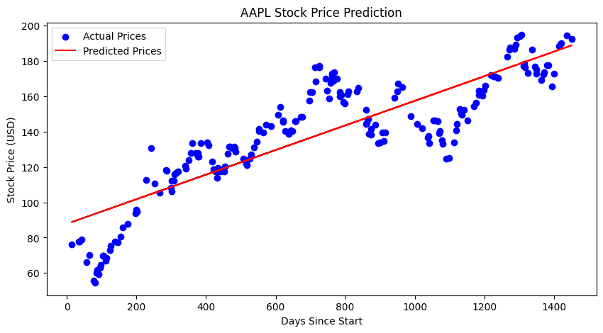

# **Predictive Analytics for Stock Prices using Linear Regression**  

Stock price prediction is a crucial aspect of financial analysis, enabling investors to make informed decisions. This guide demonstrates how to use **Linear Regression**, a fundamental machine learning technique, to predict stock prices based on historical data. We will utilize **Python**, `yfinance` for fetching stock data, and `scikit-learn` for model training and evaluation.  
- https://colab.research.google.com/drive/1pzW6SoOo32dMImY7_i6yeWjJV1XLQgd1?usp=sharing
---

## **Step 1: Importing the Required Libraries**  

Before we start, we need to import essential libraries that will help us with data collection, manipulation, visualization, and model building.  

```python
import yfinance as yf
import numpy as np
import pandas as pd
import matplotlib.pyplot as plt
from sklearn.model_selection import train_test_split
from sklearn.linear_model import LinearRegression
from sklearn.metrics import mean_absolute_error, mean_squared_error
```

### **Explanation of Imported Libraries:**  
1. **yfinance**: Fetches historical stock price data from Yahoo Finance.  
2. **numpy**: Provides support for numerical operations.  
3. **pandas**: Helps in data manipulation and preprocessing.  
4. **matplotlib**: Used for visualizing stock price trends and model predictions.  
5. **sklearn.model_selection (train_test_split)**: Splits data into training and testing sets.  
6. **sklearn.linear_model (LinearRegression)**: Implements Linear Regression for predictive modeling.  
7. **sklearn.metrics**: Evaluates the model's performance using error metrics.  

---

## **Step 2: Downloading Historical Stock Data**  

To build a predictive model, we first need historical stock price data. We use `yfinance` to fetch stock prices for **Apple Inc. (AAPL)** from **January 1, 2020, to January 1, 2024**.  

```python
# Define the stock ticker symbol
ticker = "AAPL"

# Download historical stock data
stock_data = yf.download(ticker, start="2020-01-01", end="2024-01-01")

# Display first few rows
print(stock_data.head())
```
```
Output:

[*********************100%***********************]  1 of 1 completed

Price           Close       High        Low       Open     Volume
Ticker           AAPL       AAPL       AAPL       AAPL       AAPL
Date                                                             
2020-01-02  72.716072  72.776598  71.466812  71.721019  135480400
2020-01-03  72.009117  72.771745  71.783962  71.941328  146322800
2020-01-06  72.582901  72.621639  70.876068  71.127858  118387200
2020-01-07  72.241554  72.849231  72.021238  72.592601  108872000
2020-01-08  73.403633  73.706264  71.943744  71.943744  132079200

```

### **Understanding the Data**  

The dataset retrieved from **Yahoo Finance (`yfinance`)** contains historical stock price information for **Apple Inc. (AAPL)** from January 2, 2020, onwards. The data consists of the following columns:  

1. **Date**: Represents the trading date. This column is automatically set as the index in the dataset.  
2. **Close**: The last recorded price of AAPL stock when the market closed for the day. This is our **target variable** for prediction.  
3. **High**: The highest price that AAPL stock reached during the trading session on that particular day.  
4. **Low**: The lowest price that AAPL stock reached during the trading session on that particular day.  
5. **Open**: The price at which AAPL stock was first traded when the market opened on that day.  
6. **Volume**: The total number of AAPL shares traded during the trading session on that day.  

---

## **Step 3: Preparing the Dataset**  

Since stock prices are time-series data, we need to convert the **date values into numerical values** before applying Linear Regression. We achieve this by representing each date as the number of days since the start of the dataset.

```python
# Reset index to extract the date column
stock_data["Date"] = stock_data.index

# Convert the Date column into number of days since the start
stock_data["Days"] = (stock_data["Date"] - stock_data["Date"].min()).dt.days

# Selecting features (X) and target variable (y)
X = stock_data["Days"].values.reshape(-1, 1)  # Independent variable (Days)
y = stock_data["Close"].values  # Dependent variable (Stock Price)

# Display first few values
print(X[:5], y[:5])
```
```
Output:
[[0]
 [1]
 [4]
 [5]
 [6]] [[72.71607208]
 [72.00911713]
 [72.582901  ]
 [72.24155426]
 [73.40363312]]
```

### **Why Convert Dates into Numerical Values?**  
Linear Regression works with numerical data, but dates are in a string format. By converting them into numerical values (days since the start date), we enable the model to analyze trends over time.

---

## **Step 4: Splitting the Data into Training and Testing Sets**  

To evaluate the model's accuracy, we split the data into two parts:  
- **Training Set (80%)**: Used to train the model.  
- **Testing Set (20%)**: Used to evaluate the model’s performance.  

```python
# Split data into training (80%) and testing (20%) sets
X_train, X_test, y_train, y_test = train_test_split(X, y, test_size=0.2, random_state=42)

# Display dataset sizes
print(f"Training set size: {len(X_train)}, Testing set size: {len(X_test)}")
```
```
Output:
Training set size: 804, Testing set size: 202
```

### **Importance of Data Splitting**  
Splitting ensures that the model learns from historical data but is tested on unseen data to assess its ability to make real-world predictions.

---

## **Step 5: Training the Linear Regression Model**  

We now apply **Linear Regression**, which establishes a relationship between time (days) and stock prices.

```python
# Initialize and train the Linear Regression model
model = LinearRegression()
model.fit(X_train, y_train)

# Display model coefficients
print(f"Model Coefficient (Slope): {model.coef_[0]}")
print(f"Model Intercept: {model.intercept_}")
```
```
Output:
Model Coefficient (Slope): [0.06960968]
Model Intercept: [87.85129292]
```

### **Understanding Model Coefficients**  
- The **slope (coefficient)** represents how much the stock price changes per day.  
- The **intercept** is the predicted stock price at day 0.  

If the slope is **positive**, it suggests that stock prices tend to rise over time. If it is **negative**, prices tend to decline.

---

## **Step 6: Making Predictions**  

With the trained model, we can now predict stock prices for the test set.

```python
# Make predictions on the test set
y_pred = model.predict(X_test)

# Ensure y_test and y_pred are 1D
y_test = y_test.flatten()
y_pred = y_pred.flatten()

# Display some predictions
comparison = pd.DataFrame({"Actual": y_test, "Predicted": y_pred})
print(comparison.head(10))
```
```
Output:
       Actual   Predicted
0  176.883575  181.476309
1  139.507492  151.544148
2  148.721252  156.625655
3  170.093643  139.571283
4  127.034523  124.744422
5  162.754532  153.980487
6  167.017838  154.050096
7  168.922836  141.241916
8  131.504883  120.359012
9   69.661018   95.021090
```

### **Analyzing Predictions**  
- If the predicted prices closely match actual prices, the model is performing well.  
- If there is a large difference, we may need a more advanced model.

---

## **Step 7: Evaluating the Model’s Performance**  

To measure the accuracy of our model, we calculate the **Mean Absolute Error (MAE)** and **Mean Squared Error (MSE)**.

```python
# Calculate MAE and MSE
mae = mean_absolute_error(y_test, y_pred)
mse = mean_squared_error(y_test, y_pred)

print(f"Mean Absolute Error (MAE): {mae:.2f}")
print(f"Mean Squared Error (MSE): {mse:.2f}")
```
```
Output:
Mean Absolute Error (MAE): 14.08
Mean Squared Error (MSE): 294.01
```

### **Interpreting Error Metrics**  
- **MAE (Mean Absolute Error)**: The average absolute difference between actual and predicted prices.  
- **MSE (Mean Squared Error)**: The average squared difference, penalizing larger errors.  

Lower values of **MAE** and **MSE** indicate better model performance.

---

## **Step 8: Visualizing Actual vs. Predicted Stock Prices**  

A visualization helps compare the model's predictions with actual stock prices.

```python
plt.figure(figsize=(10, 5))

# Scatter plot of actual prices
plt.scatter(X_test, y_test, color="blue", label="Actual Prices")

# Line plot of predicted prices
plt.plot(X_test, y_pred, color="red", label="Predicted Prices")

# Labels and title
plt.xlabel("Days")
plt.ylabel("Stock Price")
plt.legend()
plt.title(f"{ticker} Stock Price Prediction")

# Show the plot
plt.show()
```

Output:



### **Understanding the Plot**  
- **Blue dots** represent actual stock prices.  
- **Red line** represents predicted stock prices based on our model.  
- A closer alignment between the dots and the line suggests better accuracy.

---

## **Next Steps & Model Enhancements**  

This model is a **basic predictive analysis** using **Linear Regression**. However, stock prices are influenced by multiple factors, and linear regression may not always be sufficient. To improve accuracy, consider:  

1. **Using Advanced Models**  
   - **LSTM (Long Short-Term Memory networks)** for better time-series forecasting.  
   - **Random Forests, ARIMA, or XGBoost** for better predictions.  

2. **Adding More Features**  
   - Incorporate **moving averages, RSI, and MACD** as features.  

3. **Handling Market Volatility**  
   - Consider external factors such as news sentiment analysis and macroeconomic indicators.  
