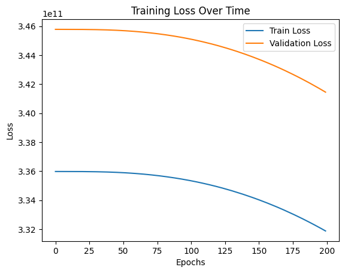
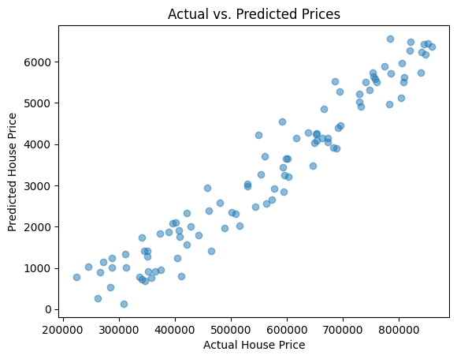

**Feed-Forward Neural Network (FNN)** example using **Scikit-Learn and TensorFlow (Keras)** to understand how neural networks predict house prices.  

---

# **Predicting House Prices with a Neural Network** 
[Colab File Link](https://colab.research.google.com/drive/1E1zTNnrhkUnF8D6M-yDFKeVsSL2s2e0c#scrollTo=-n3A0PPGfdSF)

In this example, we will build a simple neural network to predict house prices based on:  
- **Square Footage** (Size of the house)  
- **Number of Bedrooms**  
- **Location Score** (A rating of the neighborhood)  

We will use **Keras (TensorFlow)**, which makes it easy to build and train neural networks.  

---

## **Step 1: Install Required Libraries**
Before running the code, ensure you have the required libraries installed.  
```bash
pip install numpy pandas tensorflow scikit-learn matplotlib
```

---

## **Step 2: Import Libraries**
We need the following libraries:  
- `numpy` and `pandas` for handling data  
- `sklearn` for data preprocessing  
- `tensorflow` (Keras) to build the neural network  
- `matplotlib` for visualization  

```python
import numpy as np
import pandas as pd
import matplotlib.pyplot as plt
from sklearn.model_selection import train_test_split
from sklearn.preprocessing import StandardScaler
from tensorflow import keras
from tensorflow.keras import layers
```

---

## **Step 3: Create Sample Data**  
Since we don't have real data, we generate random house prices using simple rules.

```python
# Generate a dataset with 3 features: Square Footage, Bedrooms, and Location Score
np.random.seed(42)
num_samples = 500

square_footage = np.random.randint(800, 5000, num_samples)  # House size in square feet
bedrooms = np.random.randint(1, 6, num_samples)  # Number of bedrooms
location_score = np.random.randint(1, 10, num_samples)  # Neighborhood score

# Generate house prices using a simple formula with some noise
house_prices = 50000 + (square_footage * 150) + (bedrooms * 10000) + (location_score * 5000) + np.random.randn(num_samples) * 5000

# Convert to DataFrame
df = pd.DataFrame({'SquareFootage': square_footage, 'Bedrooms': bedrooms, 'LocationScore': location_score, 'Price': house_prices})

# Show first 5 rows
print(df.head())
```
#### Output
```
   SquareFootage  Bedrooms  LocationScore          Price
0           1660         1              8  350996.115613
1           4572         3              8  809035.979699
2           3892         4              4  691384.067689
3           1266         2              4  287769.933816
4           4244         4              5  745471.171685
```
---

## **Step 4: Prepare the Data**
### **1. Split Data**
We divide the data into **training (80%)** and **testing (20%)** sets.

```python
# Features (X) and Target (y)
X = df[['SquareFootage', 'Bedrooms', 'LocationScore']]
y = df['Price']

# Split into training and testing sets
X_train, X_test, y_train, y_test = train_test_split(X, y, test_size=0.2, random_state=42)
```

### **2. Normalize Data**  
Neural networks work better with normalized (scaled) data.

```python
# Scale the input features
scaler = StandardScaler()
X_train_scaled = scaler.fit_transform(X_train)
X_test_scaled = scaler.transform(X_test)
```

---

## **Step 5: Build the Neural Network**
We create a simple **3-layer neural network** using **Keras**.

```python
# Define the model
model = keras.Sequential([
    layers.Dense(10, activation='relu', input_shape=(3,)),  # 3 input features
    layers.Dense(5, activation='relu'),  # Hidden layer with 5 neurons
    layers.Dense(1)  # Output layer (House Price)
])

# Compile the model
model.compile(optimizer='adam', loss='mse')

# Show model summary
model.summary()
```

#### Output
```
Model: "sequential"
┏━━━━━━━━━━━━━━━━━━━━━━━━━━━━━━━━━━━━━━┳━━━━━━━━━━━━━━━━━━━━━━━━━━━━━┳━━━━━━━━━━━━━━━━━┓
┃ Layer (type)                         ┃ Output Shape                ┃         Param # ┃
┡━━━━━━━━━━━━━━━━━━━━━━━━━━━━━━━━━━━━━━╇━━━━━━━━━━━━━━━━━━━━━━━━━━━━━╇━━━━━━━━━━━━━━━━━┩
│ dense (Dense)                        │ (None, 10)                  │              40 │
├──────────────────────────────────────┼─────────────────────────────┼─────────────────┤
│ dense_1 (Dense)                      │ (None, 5)                   │              55 │
├──────────────────────────────────────┼─────────────────────────────┼─────────────────┤
│ dense_2 (Dense)                      │ (None, 1)                   │               6 │
└──────────────────────────────────────┴─────────────────────────────┴─────────────────┘
 Total params: 101 (404.00 B)
 Trainable params: 101 (404.00 B)
 Non-trainable params: 0 (0.00 B)
 ```

---

## **Step 6: Train the Model**
We train the neural network for **200 epochs** (iterations).

```python
# Train the model
history = model.fit(X_train_scaled, y_train, epochs=200, validation_data=(X_test_scaled, y_test), verbose=1)
```

#### Output
```
Epoch 1/200
13/13 ━━━━━━━━━━━━━━━━━━━━ 3s 53ms/step - loss: 336426172416.0000 - val_loss: 345779306496.0000
Epoch 2/200
13/13 ━━━━━━━━━━━━━━━━━━━━ 0s 19ms/step - loss: 341174812672.0000 - val_loss: 345779208192.0000
.
.
Epoch 50/200
13/13 ━━━━━━━━━━━━━━━━━━━━ 0s 6ms/step - loss: 337491656704.0000 - val_loss: 345696141312.0000
.
.
Epoch 100/200
13/13 ━━━━━━━━━━━━━━━━━━━━ 0s 10ms/step - loss: 339421298688.0000 - val_loss: 345117294592.0000
.
.
Epoch 150/200
13/13 ━━━━━━━━━━━━━━━━━━━━ 0s 9ms/step - loss: 324313907200.0000 - val_loss: 343747198976.0000
.
.
.
Epoch 200/200
13/13 ━━━━━━━━━━━━━━━━━━━━ 0s 8ms/step - loss: 329737338880.0000 - val_loss: 341451374592.0000

# To see full detailed output run it in collab
```
---

## **Step 7: Visualize Training Progress**
We plot the **loss (error)** to see how well the model is learning.

```python
plt.plot(history.history['loss'], label='Train Loss')
plt.plot(history.history['val_loss'], label='Validation Loss')
plt.xlabel('Epochs')
plt.ylabel('Loss')
plt.legend()
plt.title('Training Loss Over Time')
plt.show()
```
#### Output


---

## **Step 8: Evaluate the Model**
Let's test our model on unseen data.

```python
# Make predictions on the test set
predictions = model.predict(X_test_scaled)

# Plot actual vs. predicted prices
plt.scatter(y_test, predictions, alpha=0.5)
plt.xlabel("Actual House Price")
plt.ylabel("Predicted House Price")
plt.title("Actual vs. Predicted Prices")
plt.show()
```

#### Output


---

## **Step 9: Predict Price for a New House**
Now, let's predict the price of a **new house**.

```python
# New house: 2500 sqft, 3 bedrooms, location score 7
new_house = np.array([[2500, 3, 7]])

# Scale the input using the same scaler
new_house_scaled = scaler.transform(new_house)

# Predict price
predicted_price = model.predict(new_house_scaled)[0][0]
print(f"Predicted Price: ${predicted_price:.2f}")
```
#### Output
```
1/1 ━━━━━━━━━━━━━━━━━━━━ 0s 38ms/step
Predicted Price: $1565.07
```
---

## **Conclusion**
We have successfully built a **Feed-Forward Neural Network** that predicts house prices. We:
- **Generated synthetic house price data**
- **Preprocessed and normalized** the data
- **Built and trained a simple neural network** with TensorFlow/Keras
- **Visualized model training**
- **Tested predictions on unseen data**

This simple model can be improved with:
- **More features** (e.g., number of bathrooms, year built)
- **More data** for better accuracy
- **Hyperparameter tuning** (changing the number of layers, neurons, or learning rate)

