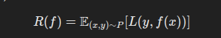
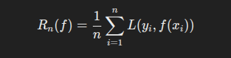
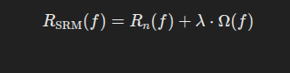

## 1. Fundamentals of Statistical Learning Theory  

### 1.1 Introduction  
Statistical Learning Theory (SLT) is a mathematical framework that explains how models learn from data and generalize to new, unseen examples. It helps us understand fundamental aspects of machine learning, including:  

- How well a model will perform on unseen data.  
- How complex a model should be to avoid overfitting or underfitting.  
- How much data is needed to train a model effectively.  

This theory forms the basis for many modern machine learning techniques and ensures that learning models are **both accurate and efficient**.  

---

### 1.2 Key Concepts in Statistical Learning Theory  

#### **1.2.1 Risk Minimization**  
In machine learning, we want to minimize the **expected loss** or **risk** of our model. The risk is the **average error** a model makes across all possible data points in the distribution.  

Mathematically, the risk \( R(f) \) is defined as:  

Where:  
- \( (x, y) \sim P \) means the data is drawn from an unknown probability distribution \( P \).  
- \( L(y, f(x)) \) is the **loss function**, measuring the error between the true label \( y \) and the model's prediction \( f(x) \).  

Since we **don't know the true data distribution \( P \)**, we approximate the risk using the **empirical risk** based on training data.  

---

#### **1.2.2 Empirical Risk Minimization (ERM)**  
In practice, since we cannot compute the exact expected risk, we minimize the **empirical risk** \( R_n(f) \), which is computed over the training dataset of \( n \) samples:  

This means we **average the errors over the training set**. A model trained using ERM simply tries to minimize the training error. However, this can lead to **overfitting** if the model learns too much from the noise in the training data.  

**Example:**  
- A deep neural network can fit the training data almost perfectly (low empirical risk) but may fail on new test data (high actual risk).  

---

#### **1.2.3 Structural Risk Minimization (SRM)**  
To prevent overfitting, we introduce **Structural Risk Minimization (SRM)**, which adds a **regularization term** to control model complexity:  

Where:  
- Ω(f) is a measure of model complexity.  
- λ is a hyperparameter that controls how much regularization is applied.  

**Example:**  
- In linear regression, **L2 regularization (Ridge Regression)** adds a penalty to the size of model coefficients, discouraging overly complex models.  

---

#### **1.2.4 Generalization and the PAC Learning Framework**  
A good model **generalizes** well, meaning it performs well on **unseen** data, not just on the training data.  

- **Probably Approximately Correct (PAC) Learning:**  
  - A model is **PAC-learnable** if it can achieve a low error with high probability given **sufficient training data**.  
  - If an algorithm can learn a function within **ϵ-error** with probability at least  **1 - δ**, then it is PAC-learnable.  

**Example:**  
- Suppose we train a classifier to distinguish between spam and non-spam emails. If the PAC learning framework holds, then with a **large enough** dataset, the classifier will be able to classify new emails accurately with high probability.  

---

### 1.3 Why is Statistical Learning Theory Important?  
- Helps us **choose the right model complexity** to balance bias and variance.  
- Ensures that machine learning algorithms **generalize** well to new data.  
- Provides **theoretical guarantees** for model performance given sufficient data.  

---

## 2. Convergence and Learnability  

### 2.1 Convergence in Machine Learning  
**Convergence** refers to how a machine learning algorithm stabilizes as it **learns from more data** or **more training iterations**.  

A model is said to converge when:  
- The **training loss no longer decreases significantly** with more iterations.  
- The **validation accuracy stops improving**, indicating that the model has learned the underlying pattern and is not just memorizing the training data.  

**Example:**  
- In **gradient descent**, the algorithm updates weights iteratively. If the learning rate is too high, it might never converge (oscillate). If too low, it may take too long to converge.  

---

### 2.2 Types of Convergence  

#### **2.2.1 Pointwise Convergence**  
- Each weight parameter of the model stabilizes after a certain number of iterations.  

#### **2.2.2 Almost Sure Convergence**  
- The model converges to an optimal function with **probability 1**.  

#### **2.2.3 Convergence in Distribution**  
- The output distribution of the model approaches the true data distribution as more data is used.  

---

### 2.3 Factors Affecting Convergence  

#### **2.3.1 Learning Rate**  
- A high learning rate can cause the model to **overshoot** the optimal solution.  
- A low learning rate may lead to **slow convergence**.  

**Solution:**  
- **Adaptive Learning Rates** (e.g., Adam, RMSprop) adjust the learning rate dynamically.  
- https://www.youtube.com/watch?v=NE88eqLngkg&t=803s

#### **2.3.2 Batch Size**  
- **Large batch sizes** speed up training but can cause models to get stuck in sharp local minima.  
- **Small batch sizes** may introduce noise but can help the model generalize better.  

**Solution:**  
- Use a **mini-batch gradient descent** approach (e.g., batch size of 32 or 64).  

#### **2.3.3 Overfitting and Underfitting**  
- **Overfitting:** The model memorizes training data but performs poorly on new data.  
- **Underfitting:** The model is too simple and does not capture patterns.  

**Solution:**  
- **Early stopping**: Stop training when validation loss stops improving.  
- **Regularization**: Penalize overly complex models to improve generalization.  

---

### 2.4 Learnability in Machine Learning  

#### **2.4.1 What is Learnability?**  
Learnability refers to whether a machine learning model can **achieve good performance given enough data and computation time**.  

#### **2.4.2 PAC Learnability**  
A function class is **PAC-learnable** if there exists an algorithm that, with high probability, finds a function that has low error on new data, given sufficient training examples.  

#### **2.4.3 No Free Lunch Theorem**  
- There is **no single best learning algorithm** for all problems.  
- The best approach depends on **data distribution and problem complexity**.  

---

### 2.5 Example: Convergence and Learnability in Neural Networks  

#### **Example: Training a Neural Network for Image Classification**  

1. **Start with random weights.**  
2. **Compute loss** (difference between predicted and actual labels).  
3. **Update weights using gradient descent** (or Adam optimizer).  
4. **Check convergence:** If the loss stops decreasing significantly, training is complete.  
5. **Test on unseen images** to check generalization.  

If the network **does not converge**, we can:  
- Adjust the **learning rate**.  
- Increase the **dataset size**.  
- Use **data augmentation** to improve generalization.  

**Further Reading and Videos:**  
- https://www.youtube.com/watch?v=vAOI9kTDVoo

---

## 3. Kullback-Leibler (KL) Divergence  
KL divergence is a measure of how different two probability distributions are from each other. It is widely used in information theory, deep learning, and Bayesian inference.

### Mathematical Definition:
\[
D_{KL}(P || Q) = \sum P(x) \log \frac{P(x)}{Q(x)}
\]
where:
- \( P(x) \) is the true distribution.
- \( Q(x) \) is the approximating distribution.

### Example:  
- If \( P(x) \) represents the actual distribution of words in the English language and \( Q(x) \) is a model’s predicted distribution, a low KL divergence means the model closely follows natural language patterns.
- In deep learning, KL divergence is used in Variational Autoencoders (VAEs) to regularize latent space representations.

**Further Reading and Videos:**  
- https://www.youtube.com/watch?v=SxGYPqCgJWM
- https://www.youtube.com/watch?v=sjgZxuCm_8Q

---

## 4. Model Selection and Bias-Variance Tradeoff  
Model selection is the process of choosing the best algorithm and hyperparameters for a given problem. The bias-variance tradeoff is a fundamental issue in machine learning that describes the balance between underfitting and overfitting.

### Bias-Variance Tradeoff:
- **High Bias (Underfitting):** The model is too simple and cannot capture underlying patterns.
- **High Variance (Overfitting):** The model learns noise instead of true patterns.

### Example:  
- A simple linear regression model on a highly nonlinear dataset will have high bias.
- A deep neural network trained on a small dataset may overfit and have high variance.

The ideal model has a balance between bias and variance, achieving low error on both training and unseen test data.

**Further Reading and Videos:**  
- [Bias-Variance Tradeoff - StatQuest](https://www.youtube.com/watch?v=EuBBz3bI-aA)

---

## 5. Cross-Validation  
Cross-validation is a technique for assessing how a model generalizes to an independent dataset. It is particularly useful when data is limited, preventing overfitting to the training data.

### Types of Cross-Validation:
- **k-Fold Cross-Validation:** The dataset is divided into k subsets, and the model is trained on k-1 subsets while tested on the remaining subset. This process is repeated k times.
- **Leave-One-Out Cross-Validation (LOOCV):** Each data point is used as a test sample once while training on the rest.

### Example:
If we have a dataset of 1000 medical records for disease prediction, using 10-fold cross-validation ensures that each subset is used for both training and testing, leading to more robust evaluation.

**Further Reading and Videos:**  
- [Cross-Validation Explained](https://www.youtube.com/watch?v=fSytzGwwBVw)

---

## 6. Regularization  
Regularization techniques help prevent overfitting by penalizing overly complex models.

### Types of Regularization:
- **L1 Regularization (Lasso):** Adds the absolute values of model weights as a penalty term, leading to sparse feature selection.
- **L2 Regularization (Ridge):** Adds the squared values of model weights as a penalty term, discouraging large coefficients.

### Example:
A deep neural network trained on a small dataset may memorize training samples. Adding L2 regularization (also known as weight decay) forces the model to generalize better by keeping weights small.

**Further Reading and Videos:**  
- [Regularization in ML](https://www.youtube.com/watch?v=Q81RR3yKn30)

---

## 7. Generative vs Discriminative Models  
Machine learning models can be broadly classified into **generative** and **discriminative** models.

### Generative Models:
These models learn the joint probability distribution \( P(X, Y) \) and can generate new data points.  
Examples:
- **Naïve Bayes Classifier:** Assumes independence between features and computes probabilities.
- **Gaussian Mixture Models (GMM):** Models data as a combination of multiple Gaussian distributions.

### Discriminative Models:
These models learn the decision boundary \( P(Y | X) \) directly without modeling the underlying data distribution.  
Examples:
- **Logistic Regression:** Finds a probability-based decision boundary.
- **Support Vector Machines (SVM):** Classifies data using a hyperplane.

### Example:  
- **Generative Approach:** Using a Gaussian Mixture Model to model handwritten digits for a handwriting recognition task.
- **Discriminative Approach:** Using logistic regression to classify spam emails based on words in the email.

**Further Reading and Videos:**  
- [Generative vs Discriminative Models](https://www.youtube.com/watch?v=ut3ehErPvHo)

---
